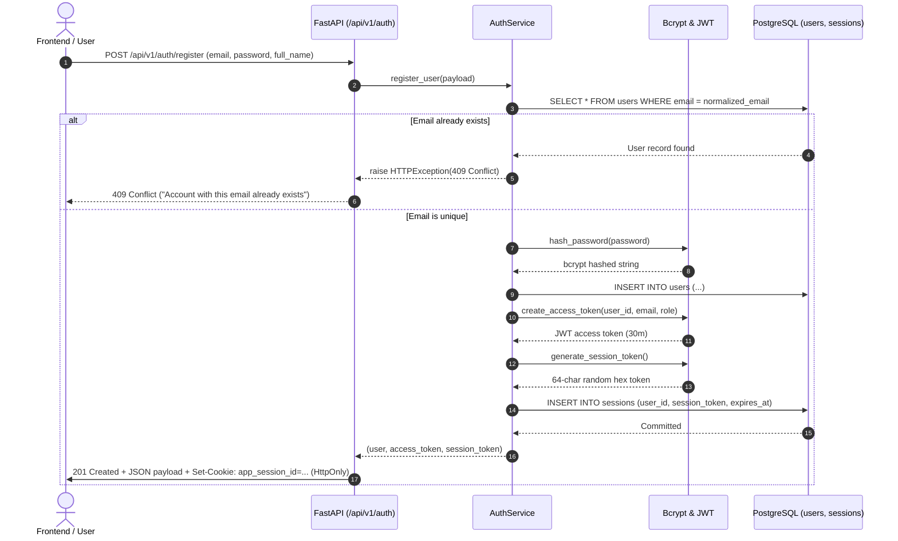
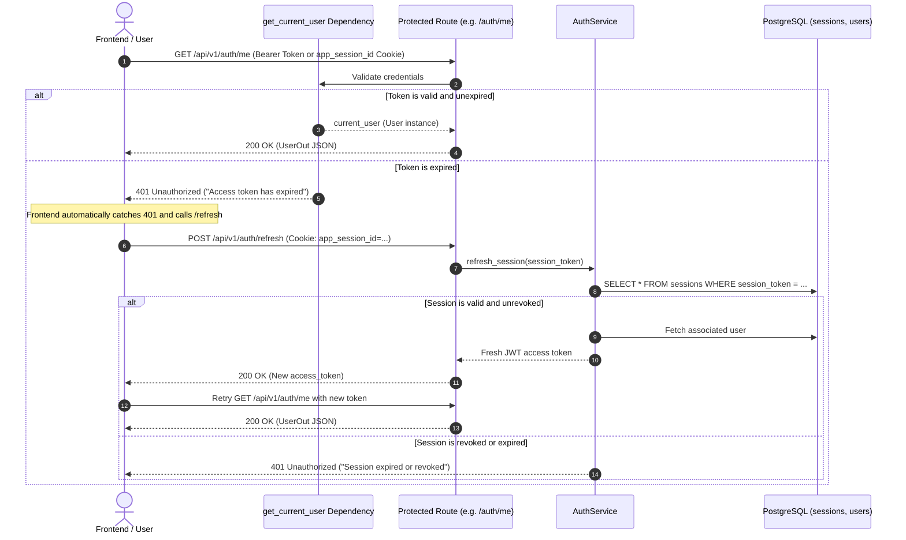

# KHOJAI (Hidden India AI) — Authentication Specification & Architecture

> **Document Version:** 1.0.0  
> **Date:** September 5, 2026  
> **Status:** Implemented & Verified with Automated Test Suite  
> **Reference:** [docs/FRONTEND_AUDIT.md](file:///c:/Users/kundu/OneDrive/Documents/KhojAI/docs/FRONTEND_AUDIT.md) & [docs/BACKEND_ARCHITECTURE.md](file:///c:/Users/kundu/OneDrive/Documents/KhojAI/docs/BACKEND_ARCHITECTURE.md)  

---

## 1. Executive Summary & Frontend Requirements

The **KHOJAI** frontend was audited to determine the exact authentication requirements:
1. **Existing Cookie Convention:** `shared/const.ts` explicitly exports `COOKIE_NAME = "app_session_id"`. The authentication layer respects this standard and issues secure, HTTP-only session cookies under this exact name.
2. **Progressive Public Access:** Destination browsing (`/discover`), destination dossiers (`/destination/:slug`), and taking the AI planner quiz (`/planner`) remain publicly accessible without forcing login barriers.
3. **Authenticated Capabilities:** User accounts enable claiming/saving custom itineraries, personal submission tracking, and content moderation for community field notes.
4. **Dual-Token Pattern:** Stateless short-lived JWT access tokens for fast API authorization, coupled with stateful long-lived database-backed session tokens for revocation and seamless token refresh.

---

## 2. Security Principles & Architecture

| Feature | Implementation Specification |
| :--- | :--- |
| **Password Hashing** | **Bcrypt (work factor 12)** with cryptographically random per-user salts. Plaintext passwords are never logged, cached, or persisted. |
| **Zero-Hash Exposure** | The `UserOut` Pydantic schema strictly omits `hashed_password`. Responses never expose password hashes. |
| **Access Tokens (JWT)** | Signed with HMAC-SHA256 (`HS256`) using `JWT_SECRET` from environment variables. Contains `sub` (User UUID), `email`, `role`, `iat`, and `exp` (30 minutes default). |
| **Refresh Tokens** | Cryptographically secure 64-character hex tokens generated via `secrets.token_hex(32)`. Stored in the `sessions` table with expiration timestamp and revocation flags. |
| **Dual Transport** | Endpoints accept authentication through both: <br>1. Standard `Authorization: Bearer <token>` header.<br>2. HTTP-only secure cookie `app_session_id`. |
| **Duplicate Prevention** | Normalized email lookups (`email.strip().lower()`) return **HTTP 409 Conflict** with clear human-readable error messages. |
| **Password Validation** | Minimum 8 characters, maximum 128 characters, requiring at least one letter and one number. Invalid formats return **HTTP 422 Unprocessable Entity**. |

---

## 3. Authentication Flows (Sequence Diagrams)

### Registration & Login Flow



### Protected Route Access & Token Refresh Flow



---

## 4. API Endpoint Specifications

### 1. Register User
* **Endpoint:** `POST /api/v1/auth/register`
* **Status Code:** `201 Created` (Success), `409 Conflict` (Duplicate), `422 Unprocessable Entity` (Validation error)
* **Request Body:**
  ```json
  {
    "email": "aarav.patel@khojai.in",
    "password": "SecurePassword123!",
    "full_name": "Aarav Patel"
  }
  ```
* **Response Body (`TokenResponse`):**
  ```json
  {
    "access_token": "eyJhbGciOiJIUzI1NiIsInR5cCI6IkpXVCJ9...",
    "token_type": "bearer",
    "expires_in": 1800,
    "user": {
      "id": "3fa85f64-5717-4562-b3fc-2c963f66afa6",
      "email": "aarav.patel@khojai.in",
      "full_name": "Aarav Patel",
      "role": "user",
      "is_active": true,
      "is_verified": false,
      "created_at": "2026-09-05T22:15:00Z",
      "updated_at": "2026-09-05T22:15:00Z"
    }
  }
  ```
* **Set-Cookie Header:** `app_session_id=<token>; Max-Age=604800; Path=/; HttpOnly; SameSite=Lax`

### 2. Login User
* **Endpoint:** `POST /api/v1/auth/login`
* **Status Code:** `200 OK` (Success), `401 Unauthorized` (Wrong credentials)
* **Request Body:**
  ```json
  {
    "email": "aarav.patel@khojai.in",
    "password": "SecurePassword123!"
  }
  ```
* **Response Body:** Identical `TokenResponse` format. Sets `app_session_id` cookie.

### 3. Refresh Access Token
* **Endpoint:** `POST /api/v1/auth/refresh`
* **Status Code:** `200 OK` (Success), `401 Unauthorized` (Expired or revoked session)
* **Request Transport:** Evaluates `refresh_token` in body or extracts `app_session_id` from cookies.
* **Response Body:** Returns new access token and user metadata.

### 4. Logout User
* **Endpoint:** `POST /api/v1/auth/logout`
* **Status Code:** `200 OK`
* **Action:** Sets `is_revoked = True` on the database `Session` record and sends an expired cookie clearing `app_session_id`.
* **Response Body:**
  ```json
  {
    "ok": true,
    "message": "Successfully logged out."
  }
  ```

### 5. Current Authenticated User (`/me`)
* **Endpoint:** `GET /api/v1/auth/me`
* **Status Code:** `200 OK` (Authenticated), `401 Unauthorized` (Missing/expired/invalid token)
* **Headers:** `Authorization: Bearer <access_token>` or Cookie: `app_session_id=<session_token>`
* **Response Body (`UserOut`):**
  ```json
  {
    "id": "3fa85f64-5717-4562-b3fc-2c963f66afa6",
    "email": "aarav.patel@khojai.in",
    "full_name": "Aarav Patel",
    "role": "user",
    "is_active": true,
    "is_verified": false,
    "created_at": "2026-09-05T22:15:00Z",
    "updated_at": "2026-09-05T22:15:00Z"
  }
  ```

---

## 5. Role-Based Access Control (RBAC)

The dependency factory `require_role(allowed_roles: list[str])` enforces endpoint authorization:

```python
from backend.app.api.deps import require_role

# Moderator or Admin only endpoint
@router.patch("/contributions/{id}/approve")
async def approve_contribution(
    id: uuid.UUID,
    admin_user: User = Depends(require_role(["moderator", "admin"]))
):
    ...
```

* **`user`**: Default role for registered travelers.
* **`moderator`**: Can review, approve, and reject community contributions.
* **`admin`**: Full administrative access across all endpoints.

---

## 6. Automated Test Suite Verification

The test suite in [backend/tests/test_auth.py](file:///c:/Users/kundu/OneDrive/Documents/KhojAI/backend/tests/test_auth.py) exercises every requirement:

| Test Case | Description | Result |
| :--- | :--- | :--- |
| `test_successful_registration` | Validates registration returns 201, valid JWT, no password hash, sets cookie | **PASSED** |
| `test_duplicate_registration` | Verifies duplicate email attempts raise 409 Conflict | **PASSED** |
| `test_successful_login` | Tests login with valid credentials returns access token and user info | **PASSED** |
| `test_invalid_password` | Verifies wrong password triggers 401 Unauthorized with generic message | **PASSED** |
| `test_invalid_token` | Tests tampered/malformed Bearer token fails with 401 Unauthorized | **PASSED** |
| `test_expired_token` | Confirms expired tokens return 401 with descriptive expiration notice | **PASSED** |
| `test_protected_endpoint_access` | Confirms unauthenticated access is rejected and authenticated access succeeds | **PASSED** |
| `test_refresh_token_flow` | Validates refreshing session tokens yields new valid access token | **PASSED** |
| `test_logout_flow` | Confirms logout revokes session in DB and invalidates future refreshes | **PASSED** |
| `test_password_strength_validation`| Confirms passwords under 8 chars or missing digits return 422 | **PASSED** |

**Total Test Result:** 18 passing tests (10 Auth + 8 Database).

---

## 7. Frontend Integration Guide

When wiring authentication into the existing React frontend:
1. **Credentials Inclusion:** Configure axios or fetch with `credentials: 'include'` so the browser automatically sends and receives the `app_session_id` cookie.
2. **Authorization Header:** Optionally store the `access_token` in React memory or state and attach `Authorization: Bearer ${accessToken}` to outbound requests.
3. **401 Interceptor:** Set up an HTTP response interceptor that catches 401 errors, issues a call to `POST /api/v1/auth/refresh`, and seamlessly retries the original request.
