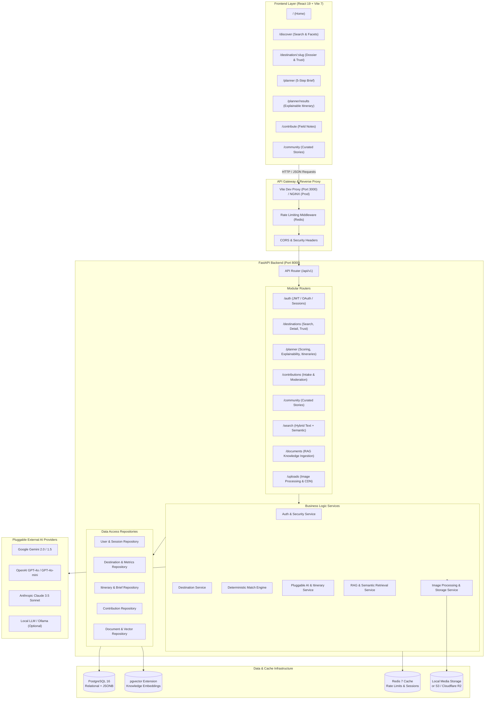
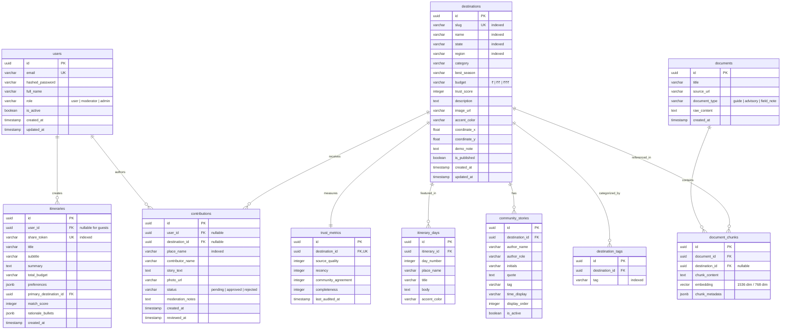
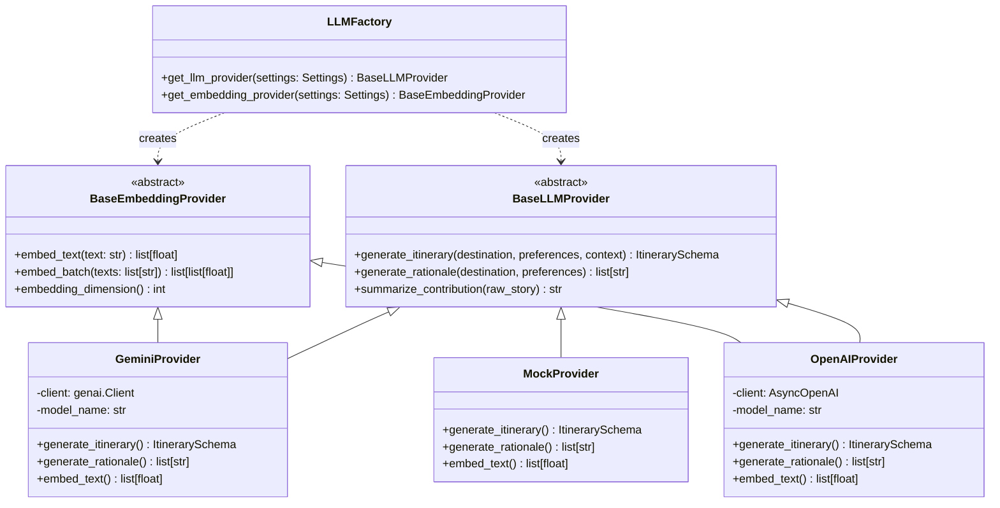
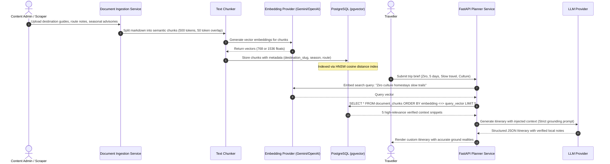
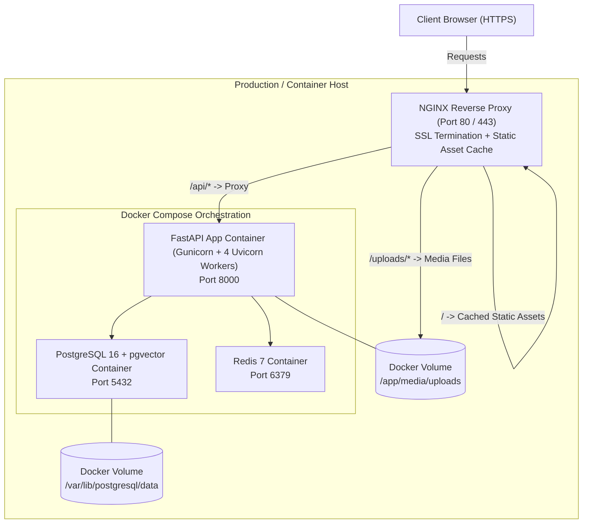

# KHOJAI (Hidden India AI) — Backend Architecture Specification

> **Document Version:** 1.0.0  
> **Date:** September 5, 2026  
> **Status:** Architecture Design Completed — Pre-Implementation Phase  
> **Author:** Lead Backend Engineer  
> **Reference:** [docs/FRONTEND_AUDIT.md](file:///c:/Users/kundu/OneDrive/Documents/KhojAI/docs/FRONTEND_AUDIT.md)  

---

## 1. Executive Summary & Technology Selection

Based on the thorough audit of the **KHOJAI** frontend in `FRONTEND_AUDIT.md`, this document establishes the production backend architecture. 

The frontend requires a backend capable of:
1. Serving fast, faceted destination discovery with multi-criteria filtering (Region, State, Budget, Season, Style, Experience).
2. Processing structured AI Trip Planner briefs with deterministic scoring, explainable rationale metrics, and custom day-by-day itineraries.
3. Ingesting and moderating community-contributed field notes and stories.
4. Providing pluggable AI/LLM generation and semantic RAG (Retrieval-Augmented Generation) across verified Indian travel knowledge.
5. Operating with strict type safety, modular maintainability, and clean separation between presentation and data layers.

### Selected Technology Stack

| Layer | Technology | Rationale & Trade-off Analysis |
| :--- | :--- | :--- |
| **Language & Runtime** | **Python 3.12+ (or 3.14)** | High developer ergonomics, unmatched native AI/LLM ecosystem (LangChain, LlamaIndex, Google GenAI SDK, OpenAI SDK), and strong asynchronous performance. |
| **Web Framework** | **FastAPI** (Async ASGI) | High throughput, native async/await, automated OpenAPI/Swagger documentation, and native dependency injection (`Depends`) for authentication and database sessions. |
| **Data Validation** | **Pydantic v2** | Blazing-fast Rust-based serialization/validation, strict type enforcement, seamless integration with FastAPI request/response models. |
| **Database & ORM** | **PostgreSQL 16 + SQLAlchemy 2.0 (Async)** | Enterprise-grade ACID compliance, relational integrity for destinations and users, JSONB support for dynamic travel signals, and `pgvector` extension for vector embeddings. |
| **Migrations** | **Alembic** | Version-controlled, reproducible schema migrations compatible with asynchronous SQLAlchemy models. |
| **Vector Engine (RAG)** | **PostgreSQL `pgvector`** | Eliminates the operational overhead of a separate vector database (e.g. Pinecone/Milvus) by colocating relational destination data and semantic embeddings in PostgreSQL. |
| **Caching & Rate Limiting** | **Redis 7** | Sub-millisecond caching for hot destination queries, distributed session store, and API rate limiting via token bucket algorithm. |
| **Background Tasks** | **FastAPI BackgroundTasks / Celery** | Asynchronous image processing, AI itinerary pre-generation, and document embedding indexing. |
| **Authentication** | **JWT (JSON Web Tokens) + Passlib/Bcrypt** | Stateless, secure authentication with dual delivery: HTTP-only secure cookies (`app_session_id`) matching existing shared constants, plus `Authorization: Bearer <token>` for API clients. |

---

## 2. High-Level Architecture Diagram



---

## 3. Modular Directory Structure

The backend will reside in a self-contained `/backend` directory alongside the existing `/client` and `/server` directories, keeping concerns cleanly separated.

```text
backend/
├── app/
│   ├── __init__.py
│   ├── main.py                     # FastAPI application factory, lifespan, CORS, middleware
│   │
│   ├── config/                     # Configuration & Environment
│   │   ├── __init__.py
│   │   ├── settings.py             # Pydantic BaseSettings loading from .env
│   │   └── logging.py              # Structured JSON logging configuration
│   │
│   ├── database/                   # Database Engine & Session Management
│   │   ├── __init__.py
│   │   ├── session.py              # Async engine & async_sessionmaker
│   │   └── base.py                 # DeclarativeBase, CommonTimestampMixin, UUIDPrimaryKeyMixin
│   │
│   ├── models/                     # SQLAlchemy 2.0 Declarative Models
│   │   ├── __init__.py
│   │   ├── user.py                 # User, Session, RefreshToken
│   │   ├── destination.py          # Destination, TrustMetric, DestinationTag
│   │   ├── itinerary.py            # Itinerary, ItineraryDay, TripBrief
│   │   ├── contribution.py         # Contribution, CommunityStory
│   │   └── document.py             # Document, DocumentChunk, VectorEmbedding (pgvector)
│   │
│   ├── schemas/                    # Pydantic v2 Request/Response Schemas
│   │   ├── __init__.py
│   │   ├── common.py               # PaginatedResponse, ErrorResponse, MessageResponse
│   │   ├── auth.py                 # LoginRequest, RegisterRequest, TokenResponse, UserResponse
│   │   ├── destination.py          # DestinationOut, DestinationDetailOut, TrustMetricsOut
│   │   ├── planner.py              # PlannerPreferencesIn, RecommendationOut, ItineraryOut
│   │   ├── contribution.py         # ContributionCreateIn, ContributionOut, StoryOut
│   │   ├── search.py               # SearchQueryIn, FilterParamsIn, SearchResultOut
│   │   └── document.py             # DocumentCreateIn, DocumentOut, SemanticSearchOut
│   │
│   ├── api/                        # REST API Routers
│   │   ├── __init__.py
│   │   ├── deps.py                 # FastAPI dependency injection (get_db, get_current_user)
│   │   └── v1/
│   │       ├── __init__.py
│   │       ├── router.py           # Master v1 APIRouter mounting sub-routers
│   │       ├── auth.py             # /auth (login, register, logout, me, refresh)
│   │       ├── users.py            # /users (profile, saved trips)
│   │       ├── destinations.py     # /destinations (list, filter, get by slug, featured)
│   │       ├── planner.py          # /planner (recommendations, itinerary generation, share)
│   │       ├── contributions.py    # /contributions (submit note, list approved)
│   │       ├── community.py        # /community (curated stories, platform signals)
│   │       ├── search.py           # /search (hybrid keyword + vector search)
│   │       ├── documents.py        # /documents (RAG knowledge ingestion - admin)
│   │       ├── uploads.py          # /uploads (photo upload, media serving)
│   │       ├── admin.py            # /admin (moderation of contributions)
│   │       └── health.py           # /health (readiness and liveness probes)
│   │
│   ├── services/                   # Core Business Logic Layer
│   │   ├── __init__.py
│   │   ├── auth_service.py         # Authentication logic, password hashing, token issue
│   │   ├── destination_service.py  # Destination catalog, search filters, trust calculations
│   │   ├── scoring_engine.py       # Deterministic match score algorithm matching frontend
│   │   ├── itinerary_service.py    # Itinerary composition, day sequencing, persistence
│   │   ├── contribution_service.py # Submission validation, moderation workflows
│   │   ├── storage_service.py      # Local disk / S3 asset handling, thumbnail generation
│   │   └── rag_service.py          # Text chunking, embedding generation, context assembly
│   │
│   ├── repositories/               # Data Access Layer (Clean CRUD / SQLAlchemy queries)
│   │   ├── __init__.py
│   │   ├── base.py                 # Generic BaseRepository[ModelType, CreateSchema, UpdateSchema]
│   │   ├── user_repo.py
│   │   ├── destination_repo.py
│   │   ├── itinerary_repo.py
│   │   ├── contribution_repo.py
│   │   └── document_repo.py
│   │
│   ├── ai/                         # Pluggable AI / LLM Provider Layer
│   │   ├── __init__.py
│   │   ├── base.py                 # Abstract BaseLLMProvider & BaseEmbeddingProvider
│   │   ├── factory.py              # LLMProviderFactory resolving provider via config
│   │   ├── providers/
│   │   │   ├── __init__.py
│   │   │   ├── gemini_provider.py  # Google Gemini SDK implementation
│   │   │   ├── openai_provider.py  # OpenAI SDK implementation
│   │   │   ├── claude_provider.py  # Anthropic SDK implementation
│   │   │   └── mock_provider.py    # Offline deterministic mock provider for testing
│   │   └── prompts/
│   │       ├── __init__.py
│   │       ├── itinerary_prompts.py# Structured day-by-day prompt templates
│   │       └── rationale_prompts.py# Explainability rationale generation prompts
│   │
│   ├── middleware/                 # ASGI Middleware
│   │   ├── __init__.py
│   │   ├── request_id.py           # Correlation ID injection for distributed tracing
│   │   ├── logging_middleware.py   # Request/response execution timing & status logging
│   │   └── rate_limit.py           # Redis-backed rate limiting
│   │
│   ├── security/                   # Cryptography & Security Controls
│   │   ├── __init__.py
│   │   ├── jwt.py                  # JWT creation, decoding, token expiration checks
│   │   └── password.py             # Bcrypt hashing & verification
│   │
│   └── utils/                      # Helper Functions
│       ├── __init__.py
│       ├── slug.py                 # URL slugification utility
│       ├── pagination.py           # Page & limit pagination calculations
│       └── sanitize.py             # HTML/text sanitization for user submissions
│
├── alembic/                        # Database Migration Scripts
│   ├── versions/
│   ├── env.py
│   └── script.py.mako
├── tests/                          # Automated Pytest Suite
│   ├── conftest.py                 # Test DB fixtures, mock LLM client, async client
│   ├── unit/
│   └── integration/
├── alembic.ini                     # Alembic configuration
├── pyproject.toml / requirements.txt # Python dependencies
├── .env.example                    # Template environment variables
└── README.md                       # Backend developer instructions & API documentation
```

---

## 4. Database Architecture & Schema Design

The schema uses PostgreSQL 16 with native UUIDs, JSONB for flexible travel metadata, and `pgvector` for 768-dimensional or 1536-dimensional semantic embeddings.

### Entity-Relationship (ER) Model



### Table Definitions & Indexing Strategy

1. **`destinations`**:
   * Unique index on `slug`.
   * Composite B-tree index on `(region, budget, state)`.
   * GIN index on full-text search vector `to_tsvector('english', name || ' ' || state || ' ' || description)`.
2. **`trust_metrics`**:
   * One-to-one foreign key with `destinations.id` with `ON DELETE CASCADE`.
3. **`itineraries`**:
   * Unique index on `share_token` (cryptographically random URL-safe token, e.g. `nanoid(12)`).
   * Index on `user_id` for quick retrieval of user trip history.
4. **`document_chunks` (pgvector)**:
   * HNSW index (`vector_cosine_ops`) for lightning-fast approximate nearest neighbor (ANN) vector search:
     ```sql
     CREATE INDEX idx_chunks_embedding_hnsw ON document_chunks 
     USING hnsw (embedding vector_cosine_ops) WITH (m = 16, ef_construction = 64);
     ```

---

## 5. Authentication & Authorization Architecture

### Strategy: Progressive Dual-Delivery Authentication

The audit revealed that the frontend is currently **100% accessible to anonymous guests**, and `SiteHeader` does not display a mandatory login prompt.
Therefore, the backend will implement **Progressive Authentication**:
1. **Public Reading & Exploration:** Browsing destinations (`/discover`), viewing detail dossiers (`/destination/:slug`), and taking the planner quiz (`/planner`) require **no authentication**.
2. **Anonymous Session Handling:** Guest users who complete the planner receive an itinerary tied to a public `share_token` saved in their local session.
3. **Claiming & Saving Itineraries:** Users can optionally sign up or log in to link their generated itineraries and contributions to their permanent account.
4. **Administrative Operations:** Moderating contributions and uploading knowledge documents requires the `ADMIN` or `MODERATOR` role.

### Token Specification
* **Access Token:** Short-lived JWT (15 to 30 minutes validity), containing `sub` (user_id), `email`, `role`, and `exp`.
* **Refresh Token:** Long-lived cryptographically secure random token (7 to 30 days) stored in the database and delivered in an `HttpOnly`, `Secure`, `SameSite=Lax` cookie named `app_session_id` (matching `shared/const.ts`).
* **Header Support:** The API accepts both cookie-based authentication and standard `Authorization: Bearer <access_token>` headers to accommodate diverse client environments.

### Role Hierarchy & Permissions
* **`GUEST`**: Read destinations, read community quotes, run scoring engine, submit field notes (flagged as `pending`), view shared itineraries.
* **`USER`**: All guest permissions + save itineraries to profile, edit own contributions, view personal submission history.
* **`MODERATOR`**: All user permissions + review pending contributions (`/api/v1/admin/contributions`), approve/reject submissions, update destination trust metrics.
* **`ADMIN`**: All moderator permissions + manage destination records, trigger document ingestion and RAG embedding rebuilds, manage user roles.

---

## 6. API Architecture & Endpoint Specifications

All endpoints are grouped under `/api/v1` with consistent JSON envelopes, HTTP status codes, and error formatting.

### 1. Destinations API (`/api/v1/destinations`)
* **`GET /api/v1/destinations`**
  * *Query Parameters:* `q` (string), `region` (string), `state` (string), `budget` (string), `style` (string), `season` (string), `experience` (string), `sort` (`recommended | most_trusted | budget | offbeat`), `page` (int, default 1), `limit` (int, default 20).
  * *Response:* `PaginatedResponse[DestinationOut]` including items, total, page, total_pages.
* **`GET /api/v1/destinations/featured`**
  * *Response:* Curated list of 4 featured destination objects for the landing page (`Home.tsx`).
* **`GET /api/v1/destinations/:slug`**
  * *Response:* Comprehensive `DestinationDetailOut` including destination attributes, full `trustMetrics`, contextual "What We Know" fields, community pulse quote, and nearby destinations.
* **`GET /api/v1/destinations/signals/summary`**
  * *Response:* Aggregated metrics matching `Home.tsx` counters (e.g. `{ community_insights: 126, seasonality_months: 12, access_signals: 8, cost_signal: "₹₹" }`).

### 2. AI Trip Planner API (`/api/v1/planner`)
* **`POST /api/v1/planner/recommendations`**
  * *Purpose:* Takes the 5-step preference brief from `Planner.tsx` and executes the deterministic explainability scoring algorithm.
  * *Request Body (`PlannerPreferencesIn`):*
    ```json
    {
      "budget": "₹15,000",
      "days": "5 days",
      "style": "Slow travel",
      "interests": ["Nature", "Culture"],
      "group": "2 people"
    }
    ```
  * *Response (`list[RecommendationOut]`):* Top 3 ranked recommendations matching the frontend contract:
    ```json
    [
      {
        "destination": { "slug": "ziro", "name": "Ziro", ... },
        "match_score": 94,
        "budget_fit": 90,
        "style_fit": 92,
        "experience_fit": 88,
        "season_fit": 95,
        "reasons": [
          "Fits your nature preference",
          "Matches your slow travel style",
          "Within your selected budget",
          "Strong destination confidence",
          "Good fit for your 5-day trip"
        ]
      }
    ]
    ```
* **`POST /api/v1/planner/itinerary`**
  * *Purpose:* Generates or customizes a day-by-day itinerary for the selected destination.
  * *Request Body:* `{ "destination_slug": "ziro", "preferences": { ... } }`
  * *Response (`ItineraryOut`):*
    ```json
    {
      "id": "uuid",
      "share_token": "ziro-slow-5d-x9a2",
      "title": "A slower side of the Northeast",
      "subtitle": "Slow travel · 5 days · 2 people",
      "summary": "A considered loop through rice terraces, river-island culture...",
      "total_budget": "₹15,000 / person",
      "days": [
        {
          "day": "01",
          "place": "Ziro",
          "title": "Arrive into the green",
          "body": "Settle into a community stay, then walk the terrace edges as the valley turns gold.",
          "accent": "#6a7a4a"
        }
      ]
    }
    ```
* **`GET /api/v1/planner/itinerary/:share_token`**
  * *Purpose:* Fetches a saved itinerary when accessed via shared link (supporting the `Share2` button on `PlannerResults.tsx`).

### 3. Community & Contribution API (`/api/v1/contributions` & `/api/v1/community`)
* **`GET /api/v1/community/stories`**
  * *Response:* List of curated community story quotes (`Community.tsx`).
* **`POST /api/v1/contributions`**
  * *Purpose:* Receives user submissions from `/contribute`.
  * *Request Body:*
    ```json
    {
      "place": "Tawang Monastic Trail",
      "name": "Vikram S.",
      "story": "Start early before the valley wind picks up. The monks at the lower prayer hall offer warm butter tea to quiet travellers."
    }
    ```
  * *Response:* `{ "ok": true, "id": "uuid", "message": "Thanks, Vikram S.. Your note is in the field log." }`
* **`POST /api/v1/uploads`**
  * *Purpose:* Multipart file upload endpoint for contributor photos (`ImagePlus` button on `Contribute.tsx`). Validates JPEG/PNG/WebP, enforces 5MB limit, resizes thumbnail, and returns storage URL.

### 4. Search API (`/api/v1/search`)
* **`GET /api/v1/search`**
  * *Purpose:* Performs combined keyword + faceted search.
* **`GET /api/v1/search/semantic`**
  * *Purpose:* Uses vector embeddings to find destinations or stories conceptually related to a user prompt (e.g. *"quiet cabin with pine scent and stream walks"*).

### 5. Authentication API (`/api/v1/auth`)
* **`POST /api/v1/auth/register`** — Register new user.
* **`POST /api/v1/auth/login`** — Issue access JWT and set `app_session_id` cookie.
* **`POST /api/v1/auth/logout`** — Invalidate refresh token and clear cookie.
* **`GET /api/v1/auth/me`** — Return authenticated user profile and saved trip counts.
* **`POST /api/v1/auth/refresh`** — Exchange refresh token for fresh access token.

---

## 7. AI Architecture & Pluggable Provider Pattern

To avoid vendor lock-in and enable zero-downtime swapping of AI backends (e.g. Google Gemini, OpenAI GPT, Anthropic Claude, or local Ollama), the backend employs the **Abstract Factory / Adapter Pattern**.

### Pluggable Interface Design



### Configuration-Driven Provider Switching
The AI provider is dynamically selected via `.env`:
```env
# AI Provider Options: 'gemini' | 'openai' | 'claude' | 'mock'
AI_PROVIDER=gemini
AI_API_KEY=your_gemini_api_key_here
AI_MODEL_NAME=gemini-2.0-flash
EMBEDDING_PROVIDER=gemini
EMBEDDING_MODEL_NAME=text-embedding-004

# If switching to OpenAI:
# AI_PROVIDER=openai
# AI_API_KEY=sk-...
# AI_MODEL_NAME=gpt-4o-mini
# EMBEDDING_PROVIDER=openai
# EMBEDDING_MODEL_NAME=text-embedding-3-small
```

### Deterministic Fallback Mechanism
If external AI providers experience downtime, rate limits, or network timeouts, the `ScoringService` falls back automatically to the **deterministic local algorithm** derived directly from `client/src/data/destinations.ts` (`buildPlannerRecommendations`). This guarantees that user trip generation **never fails or crashes** due to an external AI outage.

---

## 8. RAG (Retrieval-Augmented Generation) Architecture

The RAG pipeline grounds AI itinerary recommendations in authentic, verified Indian destination intelligence rather than generic LLM hallucinations.



### Ingestion & Chunking Specification
* **Chunk Size:** 400–600 tokens (~1,800 characters) preserving section headers and location names.
* **Overlap:** 50 tokens to avoid cutting context across sentence boundaries.
* **Metadata Attachment:** Every chunk records `destination_id`, `destination_slug`, `region`, `topic` (`access | stay | culture | seasonal`), and `source_trust_weight`.

---

## 9. File Processing & Media Architecture

### The `/manus-storage/*` Issue & Solution
The audit identified that frontend images reference `/manus-storage/*.jpg` proxied to Manus Forge cloud storage. In local development without Forge credentials, these images fail to load.

**Architecture Resolution:**
1. **Local Asset Bridge:** The backend will include a static media handler mounted at `/manus-storage` and `/uploads` using FastAPI `StaticFiles`.
2. **Asset Seeding:** High-resolution destination landscape images corresponding to the 8 audited destinations will be provided in `backend/static/destinations/` and symlinked/copied to `client/public/manus-storage/`.
3. **User Uploads:** When users upload photos via `/contribute`, files are processed asynchronously:
   * Validate MIME type against allowed list (`image/jpeg`, `image/png`, `image/webp`).
   * Validate file size (max 5 MB).
   * Process via Pillow: strip EXIF metadata (privacy), re-encode to WebP at 85% quality, and generate a 400x300 thumbnail for card views.
   * Persist to local disk (`/media/uploads/`) or S3-compatible object storage (Cloudflare R2 / AWS S3) depending on environment configuration.

---

## 10. Search Architecture

The search engine implements a **Hybrid Search Pipeline** on `/api/v1/destinations` and `/api/v1/search`:

1. **Faceted Structured Filtering:**
   * Exact and set matches on `region`, `state`, `budget`, `style`, `season`, `experience`.
   * High-speed B-tree index lookups running in under 5ms.
2. **PostgreSQL Full-Text Search (Lexical):**
   * Using PostgreSQL `tsvector` and `tsquery` with English stemming:
     ```sql
     WHERE to_tsvector('english', name || ' ' || state || ' ' || description || ' ' || tags) 
           @@ plainto_tsquery('english', :search_query)
     ```
3. **Semantic Similarity Search (Vector):**
   * For open-ended natural language queries (e.g. *"foggy valleys with village tea stalls"*), the query is converted into an embedding and matched against `document_chunks` using `pgvector` cosine similarity (`<=>`).
4. **Result Fusion (RRF):**
   * Results are fused and ranked using Reciprocal Rank Fusion (RRF) combining keyword hits and semantic proximity.

---

## 11. Frontend / Backend Communication Strategy

### Development Mode (Local Pair Running)
In development, the React frontend and FastAPI backend run concurrently on separate ports:
* **Frontend:** Vite dev server on `http://localhost:3000`
* **Backend:** FastAPI ASGI server on `http://localhost:8000`
* **Vite Proxy:** In [vite.config.ts](file:///c:/Users/kundu/OneDrive/Documents/KhojAI/vite.config.ts), add a proxy rule:
  ```typescript
  server: {
    port: 3000,
    proxy: {
      "/api": {
        target: "http://localhost:8000",
        changeOrigin: true,
      },
      "/manus-storage": {
        target: "http://localhost:8000",
        changeOrigin: true,
      }
    }
  }
  ```
  This guarantees zero CORS friction during development and allows frontend API calls to use relative URLs (`/api/v1/destinations`).

### Production Mode (Unified Container)
* A reverse proxy (NGINX or Caddy) or FastAPI itself serves the static production build from `dist/public` on `/` while routing `/api/*` to the FastAPI application workers.

---

## 12. Error Handling & Observability Strategy

### Standardized Error Envelope
All error responses adhere to RFC 7807 (Problem Details for HTTP APIs) structured JSON:

```json
{
  "error": {
    "code": "DESTINATION_NOT_FOUND",
    "message": "Destination with slug 'unknown-valley' was not found.",
    "details": {},
    "request_id": "req_8f3d1b9a2c",
    "timestamp": "2026-09-05T21:45:00Z"
  }
}
```

### Global Exception Handlers
1. **`RequestValidationError`:** Returns HTTP 422 with exact field-level validation issues (invalid budget enum, negative days, etc.).
2. **`AppException` (Base custom exception):** Typed domain errors with defined status codes (`ResourceNotFoundException`, `UnauthorizedException`, `RateLimitExceededException`).
3. **`Exception` (Unhandled fallback):** Logs full stack trace with correlation `request_id` and returns a sanitized HTTP 500 error to the client.

### Structured Logging
* Log entries formatted as JSON in production containing `timestamp`, `level`, `request_id`, `method`, `path`, `duration_ms`, and `status_code`.

---

## 13. Security Strategy

1. **Secret Isolation:** All credentials (database passwords, JWT secret keys, external AI API keys) loaded strictly from environment variables via Pydantic `BaseSettings`. No secrets in source code.
2. **Password Security:** Passwords hashed with `bcrypt` (work factor 12) or `argon2id`.
3. **SQL Injection Immunity:** 100% parameterization via SQLAlchemy 2.0 ORM expressions. Zero raw unescaped string concatenations.
4. **XSS Protection:** Output sanitization on user-submitted stories and notes. Content-Security-Policy (CSP) headers sent via middleware.
5. **Rate Limiting:** IP-based and user-based token bucket rate limiter:
   * Public endpoints: 60 requests / minute.
   * AI planner endpoints: 10 requests / minute (prevents external API cost abuse).
   * Auth endpoints: 5 attempts / minute (prevents brute-force attacks).
6. **CORS Enforcement:** Strict origin whitelisting (`ALLOWED_ORIGINS` in config).

---

## 14. Deployment Architecture



---

## 15. Summary of Deliverables & Implementation Roadmap

| Phase | Target Deliverables | Verification Strategy |
| :--- | :--- | :--- |
| **Phase 1: Backend Scaffolding** | Create `backend/` structure, `requirements.txt`, `config/settings.py`, `database/session.py`, base models, and FastAPI app factory. | Run `pytest` on basic `/health` endpoint and verify database connection. |
| **Phase 2: Data Models & Seeding** | Define SQLAlchemy models (`Destination`, `TrustMetric`, `Itinerary`, `Contribution`), Alembic migration, and seed script populating the 8 verified Indian destinations and mock stories. | Verify database tables and run query tests against seed data. |
| **Phase 3: Core API Services** | Implement destination search/filter service, deterministic match scoring service, contribution intake service, and auth service. | Unit test scoring engine against `buildPlannerRecommendations` in frontend; test all endpoints with FastAPI `TestClient`. |
| **Phase 4: AI & RAG Integration** | Implement pluggable `BaseLLMProvider` with Gemini and Mock adapters; configure prompt templates for itinerary generation and explainability rationale. | Verify fallback to mock provider when offline; test Gemini provider with live API key. |
| **Phase 5: Frontend Integration** | Update `vite.config.ts` proxy; connect frontend `mockServices.ts` to live `/api/v1` endpoints; seed local images for `/manus-storage/*`. | Full end-to-end browser walkthrough: Discover filter, Destination detail view, AI Planner generation, and Contribution submission. |
