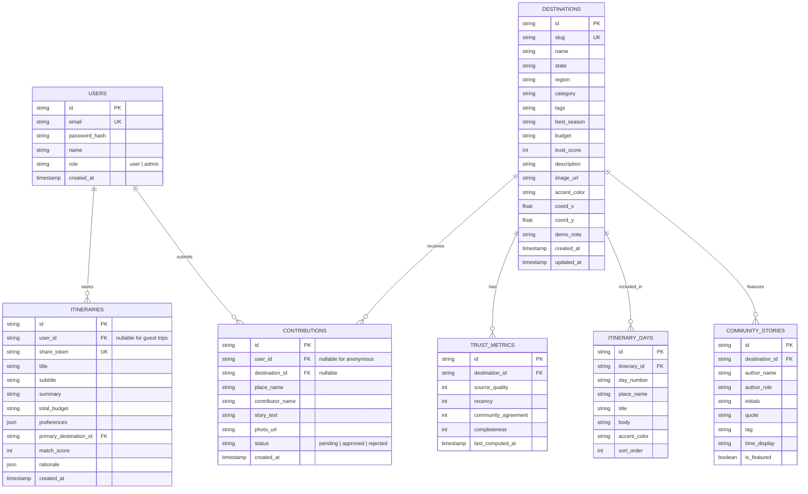

# KHOJAI (Hidden India AI) — Frontend Architecture & Backend Integration Audit

> **Audit Date:** September 5, 2026  
> **Role:** Lead Backend Engineer  
> **Repository:** `KhojAI` (internal package name: `hidden-india-ai`)  
> **Target Document:** `/docs/FRONTEND_AUDIT.md`  
> **Audit Status:** Complete — Pre-Backend Implementation Phase  

---

## 1. Executive Summary

This audit establishes a complete technical understanding of the existing frontend application generated by Manus AI. The application is branded as **Hidden India AI** (codebase: **KHOJAI**), designed as an editorial, community-powered field guide and AI-assisted trip planner for lesser-known destinations across India.

The frontend is currently a **pure static client application** running on React 19, Vite 7, and Tailwind CSS v4. All destination data, community stories, itinerary generation, filter mechanics, and trust metrics are currently hardcoded in local mock files or computed in-memory.

This audit outlines the frontend framework, routes, design system, component hierarchy, form contracts, state handling, mock data structures, and the required backend architecture (endpoints, database schemas, external services, and integration risk mitigation).

---

## 2. Frontend Framework & Architecture

| Parameter | Specification | Notes |
| :--- | :--- | :--- |
| **Core Framework** | React 19 (`19.2.1`) | Functional components with hooks (`useState`, `useEffect`, `useMemo`, `useRef`). |
| **DOM Renderer** | React DOM (`19.2.1`) | Mounted via `createRoot` in `client/src/main.tsx`. |
| **Language** | TypeScript 5.6.3 | Target: `ESNext`, strict type checking enabled, path aliases `@/*` and `@shared/*`. |
| **Client Router** | Wouter (`3.3.5`) | Lightweight routing library; uses `Switch`, `Route`, `Link`, `useLocation`, `useRoute`. Includes a local patch `patches/wouter@3.7.1.patch`. |
| **Styling Engine** | Tailwind CSS v4 (`4.1.14`) | Implemented via `@tailwindcss/vite` (`4.1.3`) and `@tailwindcss/typography`. Utilizes `@theme inline` tokens. |
| **Theme / Tokens** | Custom Vanilla CSS + OKLCH Tokens | Defined in `client/src/index.css`. Includes custom colors (`--color-paper: #f6f5ef`, `--color-ink: #1f261e`, `--color-saffron: #c5653a`, `--color-olive: #5f744b`, etc.). |
| **Typography** | Google Fonts | `Playfair Display` (editorial serif headers), `DM Sans` (body font), `DM Mono` (kicker and metadata text). |
| **Component Primitives** | Radix UI (`@radix-ui/react-*`) | 26 Radix primitive packages wrapping dialogs, tabs, popovers, select, dropdowns, tooltips, etc. |
| **Iconography** | Lucide React (`0.453.0`) | Comprehensive icon set used across all views. |
| **Animation** | Framer Motion (`12.23.22`) + CSS animations | Custom utility classes `animate-rise`, `animate-fade`, and texture overlays `grain`, `paper-grid`. |
| **Toast Notifications** | Sonner (`2.0.7`) | Mounted in `App.tsx` at `position="bottom-right"` with dark styling (`#1f261e`). |

---

## 3. Build System & Tooling

* **Bundler:** Vite 7 (`7.1.7`) configured in [vite.config.ts](file:///c:/Users/kundu/OneDrive/Documents/KhojAI/vite.config.ts).
* **Vite Plugins:**
  1. `@vitejs/plugin-react`: Standard React JSX transformation.
  2. `@tailwindcss/vite`: Tailwind CSS v4 compiler.
  3. `@builder.io/vite-plugin-jsx-loc`: Injects DOM locations for visual debugging.
  4. `vitePluginManusRuntime`: Manus platform environment integration.
  5. `vitePluginManusDebugCollector`: Captures console logs, network events, and session replays, persisting to `.manus-logs/` (max 1MB).
  6. `vitePluginStorageProxy`: Intercepts `/manus-storage/*` requests and proxies them to a remote cloud bucket via `BUILT_IN_FORGE_API_URL` and `BUILT_IN_FORGE_API_KEY`.
* **Path Aliases:**
  * `@` -> `client/src`
  * `@shared` -> `shared`
  * `@assets` -> `attached_assets`
* **Build Scripts:**
  * `npm run dev`: Runs Vite dev server (`vite --host`, port 3000 default).
  * `npm run build`: Runs `vite build` (outputs to `dist/public`) and bundles `server/index.ts` with `esbuild` to `dist/index.js`.
  * `npm run start`: Runs production server `NODE_ENV=production node dist/index.js`.
  * `npm run check`: Runs `tsc --noEmit` for full type verification.
  * `npm run format`: Formats codebase with Prettier (`3.6.2`).
* **Existing Server:** Express 4 (`4.21.2`) in [server/index.ts](file:///c:/Users/kundu/OneDrive/Documents/KhojAI/server/index.ts), currently functioning solely as a static file server with SPA wildcard fallback (`* -> index.html`).

---

## 4. Existing Dependencies

### Runtime Dependencies (`package.json`)
* **Core & Routing:** `react`, `react-dom`, `wouter`
* **Form & Validation:** `react-hook-form` (`^7.64.0`), `@hookform/resolvers` (`^5.2.2`), `zod` (`^4.1.12`), `input-otp` (`^1.4.2`) *(Note: these are installed but not yet integrated into the current static pages)*
* **UI & Components:** Complete Radix UI suite (accordion, alert-dialog, aspect-ratio, avatar, checkbox, collapsible, context-menu, dialog, dropdown-menu, hover-card, label, menubar, navigation-menu, popover, progress, radio-group, scroll-area, select, separator, slider, slot, switch, tabs, toggle, toggle-group, tooltip)
* **Design & Utilities:** `class-variance-authority`, `clsx`, `tailwind-merge`, `tailwindcss-animate`, `lucide-react`, `cmdk`, `vaul`, `embla-carousel-react`, `react-resizable-panels`, `react-day-picker`
* **Animation & Visuals:** `framer-motion`, `recharts` (`^2.15.2`), `streamdown` (`^1.4.0`)
* **HTTP & Utilities:** `axios` (`^1.12.0`), `nanoid` (`^5.1.5`), `next-themes` (`^0.4.6`), `sonner` (`^2.0.7`), `express` (`^4.21.2`)

### Dev Dependencies
* `@tailwindcss/vite`, `@tailwindcss/typography`, `tailwindcss`, `tw-animate-css`, `autoprefixer`, `postcss`, `esbuild`, `tsx`, `typescript`, `vite`, `vitest`, `prettier`, `@types/express`, `@types/google.maps`, `@types/node`, `@types/react`, `@types/react-dom`.

---

## 5. Pages and Routes

The application defines 9 client-side routes in [client/src/App.tsx](file:///c:/Users/kundu/OneDrive/Documents/KhojAI/client/src/App.tsx):

| Route Path | Page Component | Primary Purpose & Interactive Elements |
| :--- | :--- | :--- |
| `/` | `Home.tsx` | **Landing Page:** Hero section with value proposition ("What/Why/How"), quick region selector, featured destinations grid, AI Trip Planner teaser banner, Destination Intelligence trust signals grid, community CTA, and global footer. |
| `/discover` | `Discover.tsx` | **Discovery & Search Catalog:** Real-time text search, 5 multi-select filter dropdowns (Region, State, Budget, Style, Season, Experience), sort selector (Recommended, Most Trusted, Recently Updated, Budget Friendly, Offbeat), interactive map view toggle (`MapMock`), destination card grid, and clear filters action. |
| `/destination/:slug` | `DestinationDetail.tsx` | **Destination Detail Dossier:** Hero with region badge and trust badge, Destination Intelligence breakdown card (Trust score 0–100 + 4 metrics), 6 "What We Know" context cards (Season, Budget, Access, Experiences, Transit, Homestays), Community Signals card, Community Pulse quote, and nearby destinations carousel/grid. |
| `/planner` | `Planner.tsx` | **AI Trip Planner Wizard:** 5-step interactive preference intake (Budget, Time, Style, Interests, Group). Step progression bar, back/continue buttons, and automated 5-stage animated reasoning transition (`ProcessingState`). Persists brief to `sessionStorage` and navigates to `/planner/results`. |
| `/planner/results` | `PlannerResults.tsx` | **AI Recommendations & Itinerary:** Displays computed match score (e.g. 94%), ranked recommendation cards, destination compare drawer (up to 2 destinations side-by-side), explainability metric breakdown ("Why Ziro?"), simulated 1.5s route generator, day-by-day vertical route timeline, and clipboard URL share action. |
| `/contribute` | `Contribute.tsx` | **Community Contribution Form:** Intake form for place name, author name, and local narrative insight. Includes disabled photo upload placeholder and triggers mock submission service with animated confirmation view. |
| `/community` | `Community.tsx` | **Community Stories & Field Notes:** Curated quote cards with author initials, role, time tag; four-card signal matrix; CTA to contribute. |
| `/about` | `About.tsx` | **Product Manifesto & Methodology:** Explanation of the intelligence layer, 4 core principles, SIH prototype disclaimer, and navigation prompts. |
| `*` (Catch-all) | `NotFound.tsx` | **404 Not Found Page:** Custom styled 404 message ("Wrong turn") with link back to `/`. |

---

## 6. Component Hierarchy & Reusable Elements

### Core Layout Components (`client/src/components/site.tsx`)
1. **`Shell`**: Root layout wrapper ensuring consistent background (`bg-paper`), header, page content, and footer.
2. **`SiteHeader`**: Fixed sticky header with scroll elevation detection, responsive mobile menu drawer, navigation links, and primary CTA buttons ("Contribute", "Plan my trip").
3. **`Logo`**: Editorial logo component (`hidden india / artificial intelligence`) with an active saffron dot indicator. Supports inverted white rendering on dark hero sections.
4. **`Footer`**: 4-column footer with editorial mission, navigation routes, prototype disclaimer, social placeholders, and copyright notice.
5. **`DestinationCard`**: Core visual card displaying destination photography, region pill, state, title, tags, description excerpt, best season, budget level, and compact trust score badge.
6. **`TrustScore`**: Reusable pill badge displaying numerical score (0–100) inside an olive circle with uppercase label.
7. **`TrustBreakdown`**: Deep-dive component visualizing the 4 signal dimensions:
   - Source Quality (0–100%)
   - Recency (0–100%)
   - Community Agreement (0–100%)
   - Completeness (0–100%)
8. **`MapMock`**: Custom SVG vector map of India with pinned destination dots positioned via percentage coordinates (`coordinates.x`, `coordinates.y`). Includes hover tooltip labels.
9. **`SectionKicker`**: Visual label prefix featuring a colored circular dot and uppercase tracking font.
10. **`ArrowLink`**: Editorial text link accompanied by a circular arrow icon.

### Secondary & Utility Components
1. **`MapView`** (`client/src/components/Map.tsx`): Google Maps JavaScript API integration with markers, geocoding, and directions service support. Currently unmounted in the default view in favor of `MapMock`.
2. **`ManusDialog`** (`client/src/components/ManusDialog.tsx`): Radix-based modal with "Login with Manus" CTA. Currently unmounted / unlinked from header.
3. **`ErrorBoundary`** (`client/src/components/ErrorBoundary.tsx`): Class-based error boundary with stack trace preview and page reload trigger.
4. **`ThemeProvider`** (`client/src/contexts/ThemeContext.tsx`): Context managing light/dark class on `<html>` with `localStorage` persistence. Currently defaults to static light mode.
5. **Shadcn / Radix Component Suite** (`client/src/components/ui/*`): 53 fully styled UI primitives including dialogs, inputs, sheets, badges, tabs, and buttons.

---

## 7. Forms and Form Interactions

The frontend features three distinct form interactions:

### 1. Community Contribution Form (`/contribute`)
* **Fields:**
  * `place` (`<input type="text" required>`): Name of village, trail, cafe, or viewpoint.
  * `name` (`<input type="text">`): Contributor credit name (optional).
  * `story` (`<textarea required rows={7}>`): Narrative insight ("What would you want a curious traveller to know?").
* **File Upload Button:**
  * `<button type="button" disabled title="Photo upload will connect in a future version">`
  * Features `<ImagePlus>` icon with `(future)` pill label.
* **Submission Behavior:**
  * Controlled via `useState({ place: "", story: "", name: "" })`.
  * Form `onSubmit` sets `busy = true`, calls `await contributionService.submitContribution(form)`, resets `busy = false`, and toggles `sent = true`.
  * Replaces form in-place with a confirmation card ("Your note is in the field log") and navigation link to `/community`.

### 2. AI Trip Planner Intake Wizard (`/planner`)
* **State Contract (`PlannerPreferences`):**
  * `budget`: Single-choice (`"₹8,000" | "₹15,000" | "₹25,000" | "Keep it open"`)
  * `days`: Single-choice (`"3 days" | "5 days" | "7 days" | "10+ days"`)
  * `style`: Single-choice (`"Slow travel" | "Outdoors" | "Culture-led" | "Road trip"`)
  * `interests`: Multi-choice array (`"Nature" | "Culture" | "Food" | "Outdoors" | "Heritage" | "Slow travel"`)
  * `group`: Single-choice (`"Just me" | "2 people" | "3–5 people" | "A small group"`)
* **Submission Behavior:**
  * Step progression: 0 to 4 with animated progress bars.
  * Final step "Find my places" triggers `ProcessingState` with 5 staged processing intervals (720ms delay each).
  * Serializes preference payload into `window.sessionStorage.setItem("hidden-india-planner-preferences", JSON.stringify(prefs))` and navigates to `/planner/results`.

### 3. Discover Filter & Search Bar (`/discover`)
* **Fields:**
  * Query input (`<input type="text">`) for full-text filtering across name, state, region, category, and tags.
  * Region dropdown (`<select>` with 7 options).
  * State dropdown (`<select>` with 9 options).
  * Budget dropdown (`<select>` with 4 options).
  * Travel style dropdown (`<select>` with 5 options).
  * Best season dropdown (`<select>` with 6 options).
  * Experience dropdown (`<select>` with 6 options).
  * Sort dropdown (`<select>` with 5 options).
* **Interactions:**
  * In-memory `useMemo` filtering recalculating on every change.
  * "Clear all filters" button resetting all state variables.

---

## 8. Existing API Calls & Network Layer

* **Active HTTP Network Calls:** **ZERO**. The application currently makes no HTTP calls to any server in production or development.
* **Service Abstraction Layer (`client/src/services/mockServices.ts`):**
  * Contains simulated async functions with artificial delays using `setTimeout`:
    1. `destinationService.getDestinations()`: Returns all 8 destinations (`wait(180ms)`).
    2. `destinationService.getDestinationBySlug(slug)`: Returns matched destination or fallback (`wait(120ms)`).
    3. `recommendationService.getRecommendations()`: Returns first 4 destinations (`wait(180ms)`).
    4. `plannerService.generateItinerary(preferences)`: Returns `demoItinerary` with updated subtitle (`wait(750ms)`).
    5. `contributionService.submitContribution(payload)`: Returns `{ ok: true, message: "..." }` (`wait(500ms)`).
  * *Codebase Observation:* `Contribute.tsx` imports `contributionService`. However, `Discover.tsx`, `DestinationDetail.tsx`, and `PlannerResults.tsx` bypass `mockServices.ts` and import data directly from `@/data/destinations`.
* **OAuth Endpoint Definition (`client/src/const.ts`):**
  * Defines `getLoginUrl()` constructing an OAuth authorize URL: `${VITE_OAUTH_PORTAL_URL}/app-auth?appId=...&redirectUri=${origin}/api/oauth/callback`.
* **Vite Development Proxies (`vite.config.ts`):**
  * `/__manus__/logs`: Vite middleware capturing telemetry.
  * `/manus-storage/*`: Vite middleware proxying asset requests to Manus Forge storage.

---

## 9. Mock Data Breakdown

The entire state of the platform is currently sourced from [client/src/data/destinations.ts](file:///c:/Users/kundu/OneDrive/Documents/KhojAI/client/src/data/destinations.ts):

### 1. `Destination` Collection (8 Entities)
1. **Ziro** (`ziro`) — Arunachal Pradesh (Northeast) | Score: 92
2. **Majuli** (`majuli`) — Assam (Northeast) | Score: 88
3. **Tirthan Valley** (`tirthan-valley`) — Himachal Pradesh (Himalayas) | Score: 90
4. **Gandikota** (`gandikota`) — Andhra Pradesh (South) | Score: 84
5. **Chopta** (`chopta`) — Uttarakhand (Himalayas) | Score: 87
6. **Orchha** (`orchha`) — Madhya Pradesh (Central India) | Score: 86
7. **Dzukou Valley** (`dzukou-valley`) — Nagaland (Northeast) | Score: 89
8. **Gurez Valley** (`gurez-valley`) — Jammu & Kashmir (Himalayas) | Score: 83

Each destination record includes:
* `slug`, `name`, `state`, `region`, `category`, `tags[]`, `bestSeason`, `budget`, `trustScore`, `description`, `image`, `accent`, `coordinates { x, y }`, `trustMetrics { sourceQuality, recency, communityAgreement, completeness }`, `demoNote`.

### 2. `demoItinerary` Structure
* `title`: "A slower side of the Northeast"
* `subtitle`: "Ziro → Majuli · 5 days · 2 travellers"
* `summary`: "A considered loop through rice terraces, river-island culture..."
* `totalBudget`: "₹15,000 / person"
* `days`: Array of 5 day items, each with `{ day: "01", place: "Ziro", title: "...", body: "...", accent: "..." }`.

### 3. `communityStories` Structure
* 3 quotes from "Ananya R. (Local guide · Ziro)", "Rohit M. (Weekend explorer · Pune)", and "Sonal K. (Food researcher · Delhi)".

### 4. `trustSignals` Metrics
* 4 static platform counters:
  * Community insights: 126
  * Seasonality: 12 mo
  * Access signals: 08
  * Cost signals: ₹₹

---

## 10. Audit of Specific Functional Domains

### Authentication-Related UI
* **Current State:** **Scaffolded but Disconnected.**
* `client/src/components/ManusDialog.tsx` exists as a login dialog modal.
* `client/src/const.ts` contains `getLoginUrl()` configuring an OAuth redirect to `/api/oauth/callback`.
* `shared/const.ts` exports `COOKIE_NAME = "app_session_id"`.
* **Missing Elements:** No "Log In", "Sign Up", or User Avatar button is rendered in the `SiteHeader`, mobile navigation drawer, or footer. All pages are currently 100% accessible to anonymous guests.
* **Backend Requirement:** An authentication system (supporting session cookies via `COOKIE_NAME` or JWT) is required. Endpoints must support register, login, logout, and `/api/auth/me`. The frontend should support progressive enhancement: read flows (discover, planner) remain public, while write flows (saving itineraries, submitting verified contributions) integrate authentication.

### Chat UI
* **Current State:** **Deliberately Not Present.**
* `Home.tsx` explicitly clarifies the product design philosophy: *"Not a chatbot. A considered starting point for a journey that fits your pace, budget and curiosity."*
* AI interaction is executed as a structured multi-step wizard (`/planner`) leading to an explainable recommendation dashboard (`/planner/results`).
* **Backend Requirement:** The backend should NOT build generic WebSocket chat room infrastructure, but instead build an AI generation service that consumes structured preferences and outputs structured itinerary JSON.

### Search UI
* **Current State:** **Implemented Client-Side in `/discover`.**
* Features a text search input and 6 interactive filter selectors with sort options.
* **Backend Requirement:** Full-text and faceted search endpoint `/api/destinations?q=...&region=...&state=...&budget=...&style=...&season=...&experience=...&sort=...`.

### Document & File Upload UI
* **Current State:** **Placeholder Button in `/contribute`.**
* Renders a disabled button: `<button type="button" disabled ...><ImagePlus /> Add a photo (future)</button>`.
* **Backend Requirement:** Multipart form file upload endpoint `/api/uploads` or `/api/contributions/upload` with MIME type filtering (JPEG, PNG, WebP), file size limits (e.g. 5MB), image optimization, and object storage integration.

### User / Profile UI
* **Current State:** **Not Implemented in Frontend.**
* No user dashboard, `/profile` route, or account management screens exist.
* **Backend Requirement:** Endpoints `/api/users/profile`, `/api/users/itineraries` (saved journeys), and `/api/users/contributions` ready for when the frontend introduces profile surfaces.

### Dashboard Functionality
* **Current State:** **Not Implemented in Frontend.**
* No admin panel or moderation dashboard exists.
* **Backend Requirement:** Role-based access control (Admin vs User) and `/api/admin/contributions` (review, approve, reject community submissions) so submitted field notes can be reviewed before appearing on live destination cards.

### Settings UI
* **Current State:** **Partial Theme Scaffolding.**
* `ThemeContext.tsx` supports light/dark theme toggling via `localStorage`, but is locked to light mode in `App.tsx`.
* No account settings or preferences UI exist.

### Notifications UI
* **Current State:** **Toast Notifications Active via Sonner.**
* Notifications are triggered for user feedback (e.g., copying shareable itinerary links, destination comparison limits).
* No persistent notification inbox or database-backed alert feeds exist in the UI.

### AI-Related UI
* **Current State:** **Fully Implemented as Structured Guidance & Explainability.**
  1. Intake: 5-step preference intake (`/planner`).
  2. Reasoning Feedback: 5-step animated processing screen with checkmarks, progress bar, and rotating status indicators.
  3. Explainable Match Scoring: Overall match percentage with individual fit dimensions (Budget fit, Style fit, Experience fit, Season fit, Trust score) and human-readable rationale bullet points.
  4. Dynamic Itinerary View: Day-by-day vertical route timeline with tags and descriptive narrative.
  5. Side-by-Side Comparison: Compare tray evaluating two destinations simultaneously.
* **Backend Requirement:** LLM integration (Gemini / OpenAI) capable of taking `PlannerPreferences` and returning a deterministic, validated JSON payload containing ranked destinations, match percentages, rationale bullets, and tailored day-by-day itineraries.

---

## 11. Database-Related Assumptions & Entity Design

Based on the frontend data structures, the database must support the following entities:

---

## 12. Required Backend Endpoints

Every endpoint must provide strict validation (using Zod schemas), standardized error handling, and structured JSON responses.

### A. Authentication & User Management
* `POST /api/auth/register` — Create account with email, password, and name.
* `POST /api/auth/login` — Authenticate user and issue HTTP-only cookie (`app_session_id`).
* `POST /api/auth/logout` — Clear session cookie.
* `GET /api/auth/me` — Return currently authenticated user profile.
* `GET /api/oauth/callback` — Handle OAuth redirect callback (matches existing `client/src/const.ts`).

### B. Destinations API
* `GET /api/destinations` — Retrieve filtered, searched, and sorted list of destinations.
  * *Query params:* `q`, `region`, `state`, `budget`, `style`, `season`, `experience`, `sort`, `limit`, `offset`.
* `GET /api/destinations/featured` — Retrieve curated featured destinations for the landing page (matches `featuredDestinations`).
* `GET /api/destinations/:slug` — Retrieve full dossier for a destination, including `trustMetrics`, "What We Know" context, and nearby destinations.
* `GET /api/destinations/signals/summary` — Retrieve aggregated platform metrics (e.g. 126 community insights, 12 mo seasonality).

### C. AI Trip Planner & Recommendations API
* `POST /api/planner/recommendations` — Compute scored recommendations from `PlannerPreferences`.
  * *Body:* `{ budget, days, style, interests: [], group }`
  * *Response:* Ranked array of `{ destination, matchScore, budgetFit, styleFit, experienceFit, seasonFit, reasons: [] }`.
* `POST /api/planner/itinerary` — Generate an AI-crafted day-by-day itinerary for a chosen destination and preference set.
  * *Body:* `{ destinationSlug, preferences: PlannerPreferences }`
  * *Response:* `{ id, shareToken, title, subtitle, summary, totalBudget, days: [...] }`.
* `GET /api/planner/itinerary/:shareToken` — Retrieve a previously generated itinerary for sharing via URL.

### D. Community & Contributions API
* `GET /api/community/stories` — Retrieve published community stories and quotes.
* `POST /api/contributions` — Submit a community field note / hidden gem.
  * *Body:* `{ place: string, story: string, name?: string, photoUrl?: string }`
  * *Response:* `{ ok: true, id: string, message: string }`.
* `POST /api/uploads` — Upload photo asset (multipart form data) with image validation, returning CDN/storage URL.

### E. Admin & Moderation API (Protected)
* `GET /api/admin/contributions` — List pending contributions for review.
* `PATCH /api/admin/contributions/:id/status` — Approve or reject contributions (`{ status: "approved" | "rejected" }`).

---

## 13. Required External Services & Integrations

1. **Database:** PostgreSQL (production) / SQLite or PostgreSQL with Drizzle/Prisma ORM for local development and migrations.
2. **AI / LLM Provider:** Google Gemini API (`gemini-2.0-flash` or `gemini-1.5-pro`) or OpenAI API (`gpt-4o-mini` / `gpt-4o`) for dynamic itinerary generation, recommendation explainability, and automated verification of community submissions.
3. **Object Storage:** Local static file serving (`/uploads`) in development, AWS S3 / Cloudflare R2 in production for user-uploaded photography.
4. **Maps Provider:** Google Maps JavaScript API key (configured in `.env`) or fallback to existing SVG `MapMock` if no external API key is supplied.
5. **Analytics (Optional):** Umami analytics integration referenced in `client/index.html` (`%VITE_ANALYTICS_ENDPOINT%`).

---

## 14. Potential Frontend / Backend Integration Problems & Solutions

| Identified Issue | Severity | Root Cause | Recommended Engineering Solution |
| :--- | :--- | :--- | :--- |
| **Broken Images (`/manus-storage/*`)** | **High** | The frontend uses URLs pointing to `/manus-storage/*.jpg`. In `vite.config.ts`, requests are proxied to Manus Forge cloud storage using `BUILT_IN_FORGE_API_URL` and `BUILT_IN_FORGE_API_KEY`. In local development without Forge credentials, this proxy returns 500 or 502, breaking all destination photos and hero images. | Implement an Express static asset fallback or download/generate high-quality local placeholder assets inside `client/public/manus-storage/` or `attached_assets/` so the images resolve locally in both Vite and production Express without remote dependencies. |
| **Vite Dev Server vs Express API Port** | **Medium** | `npm run dev` executes `vite --host` directly on port 3000, while `server/index.ts` is only run via `node dist/index.js` in production. If the backend is built inside Express, running Vite alone will not execute the Express API routes. | Update `vite.config.ts` with a `server.proxy` mapping `/api` requests to the Express server (running on e.g. port 3001 or 5000), or run Express with Vite in middleware mode during development. |
| **Synchronous Lookups in UI Components** | **Medium** | Pages like `DestinationDetail.tsx` use synchronous code: `const destination = getDestination(params?.slug)`. When switching to asynchronous backend API requests, components will initially render `undefined` before data loads. | Refactor `mockServices.ts` into a clean API client (or use TanStack Query / `useEffect` + `useState`) with proper loading skeletons and fallback states without altering the component layout or visual appearance. |
| **Missing Authentication UI in Header** | **Low** | The user prompt requires backend authentication capabilities, but the existing header does not have a login or user profile trigger. | Keep the core browsing and planner flows public (guest-friendly) so the existing UI is not disrupted. Provide optional login / register triggers or contextual sign-in modals when a user saves a trip or submits a contribution. |
| **Pnpm / Npm Tooling Mismatch** | **Low** | The repository contains `pnpm-lock.yaml` and `.pnpm` patch references, but the user machine does not have `pnpm` in its system PATH (only `node` and `npm`). | Use `npm` for dependency installation or document how to run with `npx pnpm` or npm-compatible scripts. |
| **Wouter Routing Patch** | **Low** | `package.json` specifies a patched dependency `"wouter@3.7.1": "patches/wouter@3.7.1.patch"`. Any re-installation with plain `npm install` must ensure the patch remains applied or does not break Wouter routing. | Verify `patches/` during backend setup and ensure routing behaves identically. |

---

## 15. Next Steps for Implementation

1. **Review and Approval:** Present this audit report to the user for validation.
2. **Environment Configuration:** Create `.env.example` and local `.env` specifying database URL, JWT secrets, AI API keys, and port definitions.
3. **Database Setup:** Initialize database schema (ORM models, migrations, and seed script pre-populated with the 8 authentic Indian destinations and community notes).
4. **Backend Server & API Routes:** Build the Express REST API with Zod validation, JWT authentication, destination search/filtering, AI itinerary generation, and contribution intake.
5. **Frontend API Client Integration:** Connect the frontend to live backend endpoints through an API service layer while preserving 100% of the existing UI, UX, and animations.
6. **Local Asset Fallback:** Provide reliable local image assets for `/manus-storage/*` so the app is fully functional offline and independent of external Manus Forge storage.
7. **End-to-End Verification:** Test all interactive user journeys across search, detail view, AI planner, and contribution submission.
