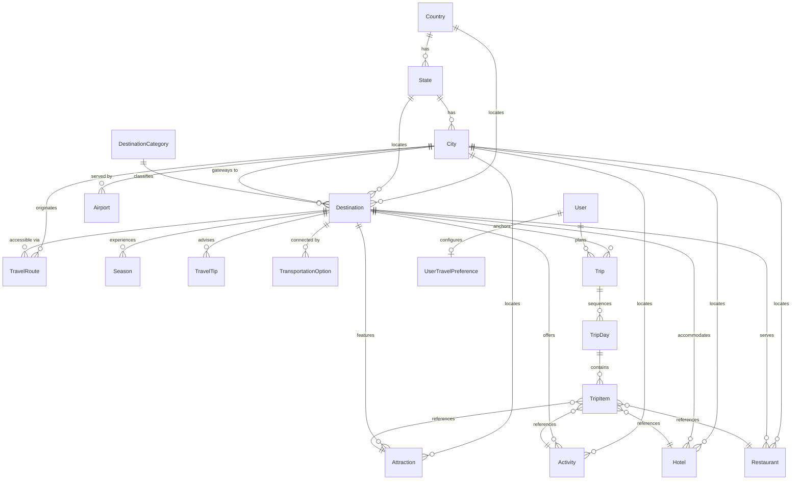
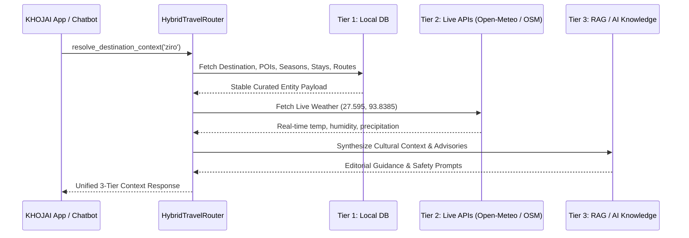

# KHOJAI Scalable Travel Data Layer Architecture

## 1. Executive Summary

The KHOJAI travel data layer is designed around a **hybrid travel-data architecture** rather than a massive static database dump:

```
┌─────────────────────────────────────────────────────────────┐
│                    KHOJAI Travel Architecture               │
│                                                             │
│   ┌──────────────────┐    ┌─────────────────────────────┐   │
│   │  Local Database  │    │     External Travel APIs    │   │
│   │   (PostgreSQL/   │ +  │   (Open-Meteo, OSM Overpass,│   │
│   │     SQLite)      │    │         Wikidata)           │   │
│   └─────────┬────────┘    └──────────────┬──────────────┘   │
│             │                            │                  │
│             └────────────┬───────────────┘                  │
│                          │                                  │
│                          ▼                                  │
│               ┌───────────────────────┐                     │
│               │   AI Knowledge / RAG  │                     │
│               │ (Editorial Narrative &│                     │
│               │   Cultural Synthesis) │                     │
│               └───────────────────────┘                     │
└─────────────────────────────────────────────────────────────┘
```

1. **Local Database (PostgreSQL / SQLite)**: Stores relatively stable, high-confidence facts that KHOJAI accesses constantly (geography, destinations, categories, verified homestays, attractions, curated routes, and user trips).
2. **External Travel APIs**: Fetches real-time, transient variables on-demand (live weather conditions, live railway/bus schedules, nearby OSM amenity nodes) without bloating local storage with volatile data.
3. **AI Knowledge / RAG**: Generates rich editorial context, cultural etiquette advice, and narrative itineraries by grounding LLMs on verified local database entities and trusted stories.

---

## 2. Entity-Relationship Diagram (ERD)



---

## 3. Data Models & Domain Schema

### 3.1 Geographic Hierarchy

* **`Country`** (`countries`): Sovereign nation entity.
  * Fields: `id` (UUID), `code` (ISO-3166-1 alpha-2, e.g. `'IN'`), `name`, `currency` (ISO-4217, default `'INR'`), `phone_code` (`'+91'`), `continent` (`'Asia'`).
  * Provenance: `source`, `source_id`, `last_synced_at`.
* **`State`** (`states`): State or Union Territory.
  * Fields: `id` (UUID), `country_id` (FK), `name`, `code` (e.g. `'AR'`, `'AS'`, `'HP'`), `region` (`'Himalayas'`, `'Northeast'`).
* **`City`** (`cities`): Urban transit hub or nearest gateway town.
  * Fields: `id` (UUID), `state_id` (FK), `name`, `city_code` (e.g. `'NHLN'`, `'JRH'`), `latitude`, `longitude`, `elevation_meters`.

### 3.2 Destination Taxonomy & Intelligence

* **`DestinationCategory`** (`destination_categories`): Offbeat travel classification.
  * Fields: `id` (UUID), `slug`, `name`, `description`, `icon_name` (Lucide icon token).
* **`Destination`** (`destinations`): Core travel anchor.
  * Fields: `id` (UUID), `slug`, `name`, `country_id` (FK), `state_id` (FK), `city_id` (FK), `category_id` (FK), `state` (label), `region`, `category` (label), `best_season`, `budget` (`₹`, `₹₹`, `₹₹₹`), `trust_score` (0–100), `description`, `image_url`, `latitude`, `longitude`, `is_hidden_gem` (Boolean), `accent_color`, `coordinate_x`, `coordinate_y`, `demo_note`.
* **`Season`** (`seasons`): Destination climate profile.
  * Fields: `id` (UUID), `destination_id` (FK), `season_name`, `start_month` (1–12), `end_month` (1–12), `weather_summary`, `avg_temp_min_c`, `avg_temp_max_c`, `rainfall_level`, `is_recommended`, `advisory_notes`.
* **`TravelTip`** (`travel_tips`): Operational advisories and local customs.
  * Fields: `id` (UUID), `destination_id` (FK), `category` (`'logistics'`, `'etiquette'`, `'packing'`, `'connectivity'`), `title`, `content`, `priority` (1–5).

### 3.3 Points of Interest (POIs)

* **`Attraction`** (`attractions`): Landmarks, heritage sites, waterfalls, monasteries.
  * Fields: `id` (UUID), `destination_id` (FK), `city_id` (FK), `name`, `category`, `description`, `latitude`, `longitude`, `entry_fee`, `timings`, `difficulty`, `recommended_duration_mins`, `tags` (JSON).
* **`Activity`** (`activities`): Guided cultural workshops, nature trails, boat crossings.
  * Fields: `id` (UUID), `destination_id` (FK), `city_id` (FK), `title`, `activity_type`, `description`, `duration_hours`, `price_range`, `seasonality`, `guide_required`.
* **`Hotel`** (`hotels`): Accommodation directory prioritizing homestays and eco-lodges.
  * Fields: `id` (UUID), `destination_id` (FK), `city_id` (FK), `name`, `stay_type` (`'Homestay'`, `'Eco-Lodge'`), `address`, `latitude`, `longitude`, `price_per_night`, `price_level`, `rating` (0.0–5.0), `contact_phone`, `contact_email`, `booking_url`, `amenities` (JSON), `sustainability_rating` (0–100).
* **`Restaurant`** (`restaurants`): Indigenous tribal hearths, local dhabas, tea houses.
  * Fields: `id` (UUID), `destination_id` (FK), `city_id` (FK), `name`, `cuisine_type`, `address`, `latitude`, `longitude`, `price_range`, `rating`, `must_try_dishes` (JSON), `opening_hours`.

### 3.4 Transit & Route Corridors

* **`Airport`** (`airports`): Aviation gateways.
  * Fields: `id` (UUID), `city_id` (FK), `name`, `iata_code` (3-letter, e.g. `'HGI'`, `'JRH'`), `icao_code`, `latitude`, `longitude`, `is_international`.
* **`TransportationOption`** (`transportation_options`): First/last mile transit connections.
  * Fields: `id` (UUID), `destination_id` (FK), `transport_type` (`'Shared Sumo Taxi'`, `'River Ferry'`), `origin_name`, `destination_name`, `duration_hours`, `cost_estimate`, `frequency`, `operator_name`, `booking_tips`.
* **`TravelRoute`** (`travel_routes`): Curated scenic corridors.
  * Fields: `id` (UUID), `destination_id` (FK), `origin_city_id` (FK), `route_name`, `mode` (`'Road'`, `'Road + Ferry'`), `distance_km`, `typical_duration_hours`, `road_condition`, `scenic_rating` (1–10), `seasonal_notes`.

### 3.5 Trip Planning & Traveler Preferences

* **`Trip`** (`trips`): Custom multi-day travel plans.
  * Fields: `id` (UUID), `user_id` (FK), `destination_id` (FK), `share_token` (unique URL token), `title`, `description`, `start_date`, `end_date`, `total_days`, `budget_tier`, `status` (`'draft'`, `'confirmed'`), `is_public`.
* **`TripDay`** (`trip_days`): Sequenced daily itinerary schedule.
  * Fields: `id` (UUID), `trip_id` (FK), `day_number`, `day_date`, `theme_title`, `notes`.
* **`TripItem`** (`trip_items`): Chronological items within a day.
  * Fields: `id` (UUID), `trip_day_id` (FK), `item_type` (`'hotel'`, `'attraction'`, `'activity'`, `'restaurant'`, `'transit'`, `'custom'`), optional FKs (`attraction_id`, `hotel_id`, `restaurant_id`, `activity_id`), `title`, `description`, `start_time`, `end_time`, `estimated_cost`, `sort_order`.
* **`UserTravelPreference`** (`user_travel_preferences`): Personalized traveler profile (1:1 with User).
  * Fields: `user_id` (FK), `budget_preference`, `preferred_pace`, `travel_styles` (JSON), `dietary_needs`, `fitness_level`, `preferred_stay_types` (JSON), `preferred_regions` (JSON).

---

## 4. Provenance Tracking & Copyright Compliance

Every external entity records provenance metadata via `ProvenanceMixin`:

```python
source: Mapped[str] = mapped_column(String(100), default="curated_editorial", nullable=False)
source_id: Mapped[Optional[str]] = mapped_column(String(255), nullable=True)
last_synced_at: Mapped[Optional[datetime]] = mapped_column(DateTime(timezone=True), nullable=True)
```

### Strict Compliance Rules:
1. **No Scraping or Storing Proprietary Reviews**: Full user reviews, copyrighted ratings, and proprietary narrative copy from TripAdvisor, Google Maps, or commercial guidebooks are strictly prohibited.
2. **Open Factual Data**: Stored records are limited to open facts (geo coordinates, elevation, IATA codes, transit schedules, official government advisory rules, public transport fares).
3. **Auditability**: `SyncService.audit_staleness()` tracks data freshness ratios and identifies records needing verification.

---

## 5. Indexing Strategy

To maintain sub-10ms response times across geo-spatial and faceted searches, the following indexes are deployed:

| Index Name | Table | Columns | Purpose |
| :--- | :--- | :--- | :--- |
| `idx_destinations_name` | `destinations` | `name` | Exact and prefix title searches |
| `idx_destinations_coordinates`| `destinations` | `latitude, longitude` | Radius / bounding box geo-lookups |
| `idx_destinations_geo_hierarchy` | `destinations` | `country_id, state_id, city_id` | Drill-down queries |
| `idx_destinations_filter` | `destinations` | `region, budget, state` | Landing page and search facets |
| `idx_destinations_provenance` | `destinations` | `source, source_id` | Synchronization auditing |
| `idx_cities_coordinates` | `cities` | `latitude, longitude` | Proximity to transit hubs |
| `idx_airports_iata` | `airports` | `iata_code` | Flight search routing |
| `idx_trips_share_token` | `trips` | `share_token` | Public itinerary URL resolution |
| `idx_trip_items_day_order` | `trip_items` | `trip_day_id, sort_order` | Day-by-day chronological sorting |

---

## 6. Hybrid Data Router Workflow

When KHOJAI compiles a destination dossier, `HybridTravelRouter.resolve_destination_context(slug)` coordinates across all three layers:



---

## 7. Management & CLI Commands

### Run Alembic Migrations
```bash
# From workspace root
cd backend
venv\Scripts\python.exe -m alembic -c alembic.ini upgrade head
```

### Seed Curated Indian Travel Knowledge
```bash
backend\venv\Scripts\python.exe -m backend.app.travel.importers.runner --seed
```

### Audit Data Staleness & Provenance
```bash
backend\venv\Scripts\python.exe -m backend.app.travel.importers.runner --audit
```
